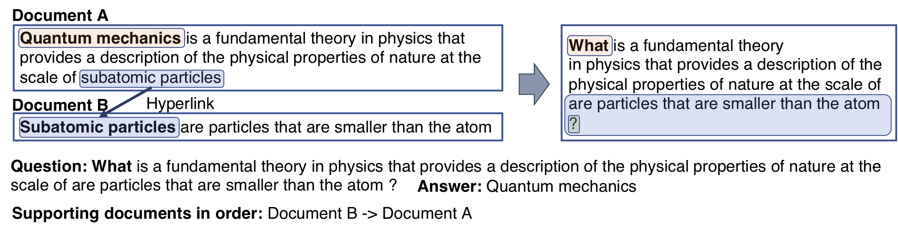

## Weakly Supervised Pre-Training for Multi-Hop Retriever

**[Yeon Seonwoo](https://yeonsw.github.io), Sang-Woo Lee, Ji-Hoon Kim, Jung-Woo Ha, Alice Oh** | ACL-Findings 2021

KAIST, NAVER Clova, NAVER AI Lab

Official implementation of **weakly supervised pre-training for multi-hop retriever**

## Abstract

In multi-hop QA, answering complex questions entails iterative document retrieval for finding the missing entity of the question. The main steps of this process are sub-question detection, document retrieval for the sub-question, and generation of a new query for the final document retrieval. However, building a dataset that contains complex questions with sub-questions and their corresponding documents requires costly human annotation. To address the issue, we propose a new method for weakly supervised multi-hop retriever pre-training without human efforts. Our method includes 1) a pre-training task for generating vector representations of complex questions, 2) a scalable data generation method that produces the nested structure of question and sub-question as weak supervision for pre-training, and 3) a pre-training model structure based on dense encoders. We conduct experiments to compare the performance of our pre-trained retriever with several state-of-the-art models on end-to-end multi-hop QA as well as document retrieval. The experimental results show that our pre-trained retriever is effective and also robust on limited data and computational resources.

## Overview of LOUVRE

Proposed pre-training data generation method

<p align="center"></p>

The multi-hop retrieval performance of LOUVRE fine-tuned on the HotpotQA train set
<p align="center"></p>

## How to run
### Setup

Download HotpotQA data

```bash
mkdir data
mkdir data/hotpotQA
cd data/hotpotQA
wget http://curtis.ml.cmu.edu/datasets/hotpot/hotpot_train_v1.1.json
wget http://curtis.ml.cmu.edu/datasets/hotpot/hotpot_dev_fullwiki_v1.json
cd ../../
```

Download HotpotQA datasets used in [MDR](https://github.com/facebookresearch/multihop_dense_retrieval).

```bash
cd data/hotpotQA
wget https://dl.fbaipublicfiles.com/mdpr/data/hotpot/hotpot_train_with_neg_v0.json
wget https://dl.fbaipublicfiles.com/mdpr/data/hotpot/hotpot_dev_with_neg_v0.json
cd ../../

mkdir data/wiki_corpus
cd data/wiki_corpus
wget https://dl.fbaipublicfiles.com/mdpr/data/hotpot_index/wiki_id2doc.json
cd ../../
```

Download the tfidf file and the Wikipedia database file used in [PathRetriever](https://github.com/AkariAsai/learning_to_retrieve_reasoning_paths).

1. Download the zip file from [here](https://drive.google.com/open?id=1ra37xtEXSROG_f90XxR4kgElGJWUHQyM)
2. Unzip hotpot_models.zip
3. Locate `hotpot_models/tfidf_retriever/wiki_open_full_new_db_intro_only-tfidf-ngram=2-hash=16777216-tokenizer=simple.npz` to `data/tfidf/`
4. Locate `hotpot_models/wiki_db/wiki_abst_only_hotpotqa_w_original_title.db` to `data/db/`

Create a new folder to store the pre-trained model, LOUVRE

```bash
mkdir checkpoints
```

Download LOUVRE from [here](https://www.dropbox.com/s/1y0yc7h208j7iov/louvre.zip?dl=0) and locate the checkpoint folder to `checkpoints/`

Create a new folder to save prediction files of LOUVRE and LOUVRE-eff

```bash
mkdir outputs
```

### Pre-Training

Generating the pre-training data

```bash
cd code/pretrain_data_generator/
CHUNK_IND=0 bash generate_pretrain_data.sh
```

Adjust `CHUNK_IND` and `NCHUNK` to proceed the generation process concurrently.

Pre-Training

```bash
cd code/louvre
bash scripts/louvre/louvre_pretrain.sh
```

### Fine-tuning LOUVRE-eff, LOUVRE

Fine-tuning LOUVRE-eff
```bash
cd code/louvre
bash scripts/louvre/louvre_eff_finetune.sh
```

Fine-tuning LOUVRE
```bash
cd code/louvre
bash scripts/louvre/louvre_finetune.sh
bash scripts/louvre/louvre_momentum.sh
```

### Test LOUVRE-eff, LOUVRE, LOUVRE_wiki

Testing LOUVRE-eff

```bash
cd code/louvre
bash scripts/louvre/louvre_eff_pred.sh
```

Testing LOUVRE

```bash
bash scripts/louvre/louvre_pred.sh
```

Testing LOUVRE_wiki

```bash
bash scripts/louvre/louvre_pred_wiki.sh
```

Evaluation

```bash
INPUT_FILE=../../outputs/louvre_eff_finetune_dev.jsonl bash eval_retriever.sh
```

## Code Reference

https://github.com/facebookresearch/multihop_dense_retrieval

https://github.com/AkariAsai/learning_to_retrieve_reasoning_paths

https://github.com/easonnie/semanticRetrievalMRS

## Copyright

Copyright 2021-present NAVER Corp. and KAIST(Korea Advanced Institute of Science and Technology)

## Acknowledgement

This work was partly supported by NAVER Corp. and Institute for Information & communications Technology Planning & Evaluation(IITP) grant funded by the Korean government(MSIT) (No. 2017-0-01780, The technology development for event recognition/relational reasoning and learning knowledge based system for video understanding).
